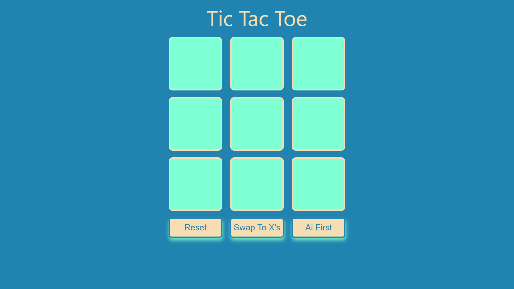

 
# Vue Tic Tac Toe

## Description
A tic tac toe game against the computer
## Table of Contents
- #### [Description](##-description)
- #### [Installation](##-Installation)
- #### [Usage Information](##-usage-information)
- #### [License](##-license)
- #### [Questions](##-questions)

## Installation
Visit it's deployment [here](https://krestle80.github.io/vueTicTacToe)
## Usage Information
Click a tile to start, or click ai first to let the computer start. To start a new game click reset. To swap from x's to o's or vice versa click the swap button
## License
Copyright  2022  Kyle Costello
 
 Licensed under the Apache License, Version 2.0 (the "License");
 you may not use this file except in compliance with the License.
 You may obtain a copy of the License at
 
 http://www.apache.org/licenses/LICENSE-2.0
 
 Unless required by applicable law or agreed to in writing, software
 distributed under the License is distributed on an "AS IS" BASIS,
 WITHOUT WARRANTIES OR CONDITIONS OF ANY KIND, either express or implied.
 See the License for the specific language governing permissions and
 limitations under the License.

## Questions
If you have any questions regarding this project please feel free to reach out at 

-Email: kylec0217@gmail.com 
-GitHub Username: [Krestle80](https://github.com/krestle80) 